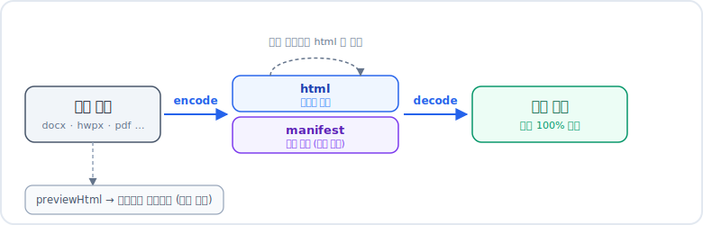

<div align="center">

# docloom

**문서를 양식 그대로 미리보고, HTML로 편집한 뒤, 원본 포맷으로 되돌리는 TypeScript 라이브러리**

<br>

[](https://kiju7.github.io/docloom/)

<sub>문서를 드래그하면 즉시 미리보기 · 업로드/저장 없는 100% 브라우저 처리</sub>

<br>


</div>

---

docloom은 **Office·한글·PDF 문서를 브라우저에서 미리보고**, 일부 포맷은 **깨끗한 HTML ↔ 원본**을
**무손실로 왕복**한다. 외부 변환 엔진(LibreOffice 등) 없이 순수 TypeScript로 동작한다.

docloom은 **"미리보기 + 왕복 채널"만** 책임진다. HTML을 어떻게 편집할지는 호출하는 쪽이 정한다.
문서를 다루기 쉬운 HTML로 바꿨다가, 원본 양식 그대로 되돌리는 용도에 맞다.

## 지원 포맷

| 포맷 | 미리보기 | 왕복 |
|---|:---:|:---:|
| **docx / hwpx / csv** | O | O 무손실 |
| **doc · ppt** (97–2003) | O | 텍스트 |
| **hwp** (한글 5.0) | O | O (편집은 `.hwpx` 출력) |
| **pptx · xlsx · xls** | O | 로드맵 |
| **pdf** | O 위치보존 | X (고정 레이아웃) |
| **md · html · txt** | O | O |

## 설치

```bash
npm install && npm run build
```

## 사용법 (Node / TypeScript)

```ts
import { previewHtml, encode, decode } from "docloom";

previewHtml(bytes);                        // 어떤 포맷이든 → 미리보기 HTML
const { html, manifest } = encode(bytes);  // 편집용 HTML + 복원 키트
decode(editedHtml, manifest);              // 편집한 HTML → 양식 보존한 원본 포맷
```

> `previewHtml()`은 보기 전용, `encode().html`은 편집/왕복용(`manifest`와 짝).

## Python 에서 쓰기

HTTP 서버로 띄워 호출한다.

```bash
npm run serve     # http://localhost:8080
```

```python
import requests

# 미리보기
html = requests.post("http://localhost:8080/preview",
                     data=open("a.hwpx", "rb").read()).text

# 편집 + 왕복
kit = requests.post("http://localhost:8080/encode",
                    data=open("a.docx", "rb").read()).json()
kit["html"] = kit["html"].replace("기존 문구", "새 문구")   # html 만 편집
restored = requests.post("http://localhost:8080/decode", json=kit).content  # 양식 보존
```

## 데모 (브라우저)

**라이브 데모 → https://kiju7.github.io/docloom/** (문서를 드래그하면 미리보기)

로컬에서 실행하려면:

```bash
npm run demo:build && npx serve demo
```

## 어떻게 양식을 보존하나

<div align="center">
  
</div>

encode 결과는 **편집용 `html` + 복원 키트 `manifest`** 한 쌍이다.
manifest가 원본 전체(스타일·머리말·이미지·표 등)를 보관하므로, decode는 **본문만** 재생성하고
나머지는 원본 그대로 둔다 → **양식이 물리적으로 안 깨진다.** 아직 이해 못 하는 요소(표·도형)는
원본을 그대로 보관(frozen)해 왕복이 깨지지 않는다.

## 주요 API

| 함수 | 설명 |
|---|---|
| `previewHtml(bytes, opts?)` | 포맷 자동판별 미리보기 |
| `encode(bytes)` / `decode(html, manifest)` | 포맷 자동판별 왕복 |
| `encodeToHtml` / `decodeToDocx` | docx 전용 (저수준) |
| `validateHtml(html, palette)` | 편집된 HTML 안전 교정 |
| `registerImageDecoder(filter, fn)` | PDF JPX/JBIG2 디코더 외부 연결 |

> 새 포맷 = `FormatAdapter`(`src/core/format.ts`) 구현 후 `registry.ts`에 등록. docx가 본보기다.

## 의존성

`fflate`(zip), `fast-xml-parser`(XML), `node-html-parser`(편집 HTML), `@rhwp/core`(한글 엔진).
변환 매핑 로직은 전부 docloom이 직접 구현한다.

## 라이선스

[MIT](./LICENSE)
